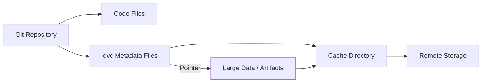

# Laporan Analisis: Manajemen Data dan Reproducibilitas Menggunakan DVC

## 1. Pendahuluan

DVC (Data Version Control) adalah sistem kontrol versi sumber terbuka yang dirancang khusus untuk alur kerja machine learning. Tujuannya adalah untuk mengatasi tantangan dalam manajemen data berukuran besar, model, dan metrik eksperimen yang tidak dapat ditangani secara efisien oleh sistem kontrol versi tradisional seperti Git. DVC memperluas fungsionalitas Git, memungkinkan versioning data dan artefak besar dengan alur kerja yang konsisten dengan manajemen kode sumber. Dokumen ini menyajikan analisis mengenai arsitektur, alur kerja, dan kapabilitas DVC.

---

## 2. Arsitektur dan Prinsip Operasi

Prinsip dasar DVC adalah pemisahan antara metadata dan data besar, yang memungkinkan Git untuk tetap berperforma tinggi.



*Gambar diganti dengan diagram Mermaid di atas untuk memastikan dapat dirender tanpa kebutuhan file eksternal.*

-   **2.1. Integrasi dengan Git**: DVC beroperasi sebagai lapisan di atas Git. Git bertanggung jawab untuk melacak semua file kode dan file metadata `.dvc` yang berukuran kecil.
-   **2.2. File Pointer `.dvc`**: Ketika sebuah file besar (misalnya, `dataset.zip`) dilacak oleh DVC (`dvc add dataset.zip`), DVC akan membuat file pointer teks kecil (`dataset.zip.dvc`). File ini berisi hash MD5 dari konten data asli dan informasi lokasi, yang kemudian di-commit ke Git.
-   **2.3. Sistem Cache**: File data besar yang sebenarnya dipindahkan ke dalam struktur direktori cache internal (`.dvc/cache`). Mekanisme ini mencegah duplikasi data dan mengoptimalkan penggunaan ruang penyimpanan.
-   **2.4. Penyimpanan Jarak Jauh (Remote Storage)**: DVC mendukung sinkronisasi cache dengan berbagai jenis penyimpanan jarak jauh, termasuk Google Drive, Amazon S3, Google Cloud Storage, dan server SSH, untuk kolaborasi dan pencadangan.

---

## 3. Alur Kerja dan Implementasi

Implementasi DVC berpusat pada pendefinisian pipeline eksperimen secara deklaratif, bukan melalui instrumentasi kode internal.

-   **3.1. Alur Kerja Versioning Data**: Prosesnya meliputi inisialisasi (`dvc init`), penambahan data (`dvc add`), dan commit file `.dvc` ke Git. Data dapat disinkronkan ke remote menggunakan `dvc push` dan diambil kembali dengan `dvc pull`.

-   **3.2. Alur Kerja Eksperimen**: Pipeline didefinisikan dalam file `dvc.yaml` sebagai serangkaian *stages* (tahapan).

    **Contoh `dvc.yaml`:**
    ```yaml
    stages:
      train:
        cmd: python train.py # Perintah yang akan dieksekusi
        deps: # Dependensi (perubahan akan memicu eksekusi ulang)
          - train.py
          - data/features.csv
        params: # Parameter yang dilacak dari params.yaml
          - training.n_estimators
          - training.max_depth
        outs: # Output yang dihasilkan
          - model.pkl
        metrics: # File metrik yang akan dilacak
          - metrics.json:
              cache: false
    ```

-   **3.3. Eksekusi Pipeline**: Untuk menjalankan eksperimen, digunakan perintah `dvc exp run`. DVC akan secara otomatis melacak versi kode, data, parameter, dan metrik untuk setiap eksekusi.

---

## 4. Analisis dan Perbandingan Eksperimen

Kapabilitas analisis DVC berfokus pada antarmuka baris perintah (CLI) yang efisien.

-   **4.1. Tabel Eksperimen**: Perintah `dvc exp show` menyajikan tabel ringkasan dari semua eksperimen yang telah dijalankan, menampilkan ID commit, parameter, dan metrik untuk perbandingan cepat.
    

-   **4.2. Perbandingan Metrik**: Perintah `dvc metrics diff [commit_a] [commit_b]` menyediakan perbandingan langsung antara metrik dari dua commit atau eksperimen yang berbeda, menyoroti perubahan numerik.

    ```sh
    $ dvc metrics diff
    Path           Metric    HEAD      workspace    Change
    metrics.json   accuracy  0.925     0.951        0.026
    metrics.json   loss      0.153     0.101       -0.052
    ```

---

## 5. Evaluasi dan Kesimpulan

-   **5.1. Keunggulan**:
    -   **Reproducibilitas**: Menjamin tingkat reproduktifitas yang sangat tinggi dengan mengikat versi kode, data, dan konfigurasi secara atomik.
    -   **Efisiensi**: Alur kerja berbasis Git yang sudah dikenal oleh banyak pengembang dan efisien dalam menangani data besar.
    -   **Agnostik**: Tidak bergantung pada bahasa pemrograman atau framework machine learning tertentu.

-   **5.2. Keterbatasan**:
    -   **Kurva Pembelajaran**: Memerlukan pemahaman yang solid tentang konsep Git dan alur kerja DVC.
    -   **Visualisasi Terbatas**: Kekuatan utamanya terletak pada CLI, dengan kapabilitas visualisasi yang lebih terbatas dibandingkan platform seperti TensorBoard atau MLFlow.